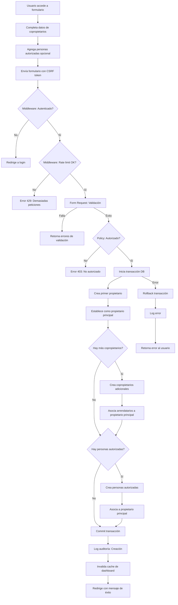
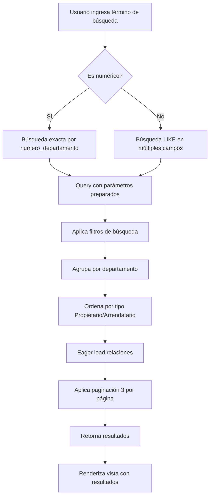
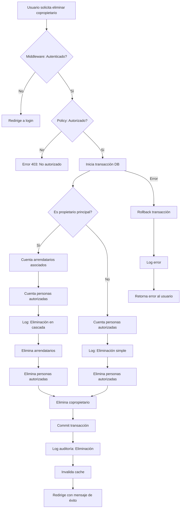
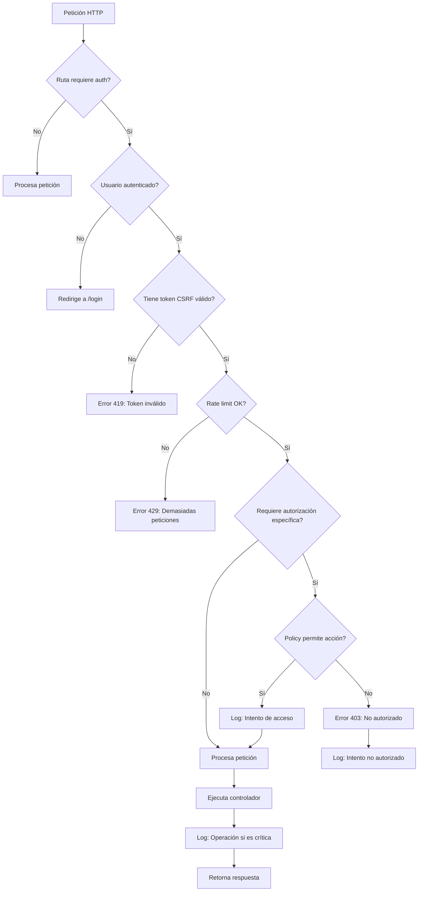
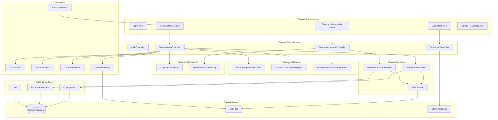
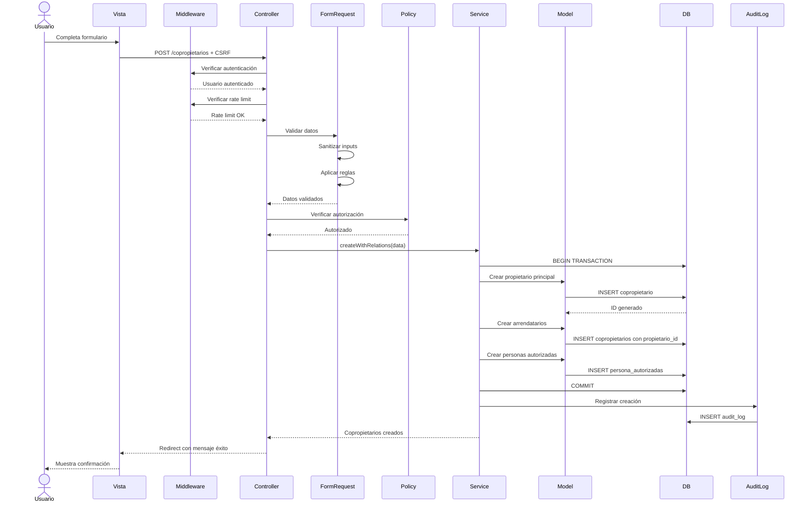
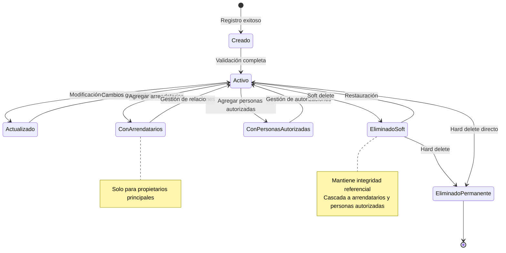

# Documento de Diseño Técnico - Sistema de Gestión de Copropietarios

## Introducción

Este documento describe el diseño técnico del Sistema de Gestión de Copropietarios, una aplicación web desarrollada en Laravel con AdminLTE que permite administrar información de propietarios, arrendatarios y personas autorizadas de edificios o condominios. El diseño aborda los 32 requisitos funcionales y de seguridad identificados, con especial énfasis en la corrección de vulnerabilidades críticas.

## Overview

El sistema está construido sobre Laravel (framework PHP) utilizando el patrón arquitectónico MVC (Model-View-Controller) con las siguientes características principales:

- **Framework**: Laravel 8.x o superior
- **UI Framework**: AdminLTE 3.x
- **Base de Datos**: MySQL/MariaDB
- **Autenticación**: Laravel Breeze/Jetstream
- **Arquitectura**: Monolítica con separación clara de responsabilidades
- **Seguridad**: Implementación de protecciones contra OWASP Top 10

### Objetivos del Diseño

1. Corregir vulnerabilidades críticas de seguridad identificadas
2. Implementar validación robusta en todas las capas
3. Establecer auditoría completa de operaciones críticas
4. Mantener integridad referencial en datos relacionados
5. Proporcionar interfaz intuitiva y responsiva
6. Garantizar escalabilidad y mantenibilidad del código


## Arquitectura

### Arquitectura General del Sistema

El sistema sigue una arquitectura MVC en capas con los siguientes componentes:

```
┌─────────────────────────────────────────────────────────────┐
│                     Capa de Presentación                     │
│  ┌──────────────┐  ┌──────────────┐  ┌──────────────┐      │
│  │ Blade Views  │  │  AdminLTE    │  │  JavaScript  │      │
│  │  Templates   │  │  Components  │  │   (Alpine)   │      │
│  └──────────────┘  └──────────────┘  └──────────────┘      │
└─────────────────────────────────────────────────────────────┘
                            ↓
┌─────────────────────────────────────────────────────────────┐
│                    Capa de Controladores                     │
│  ┌──────────────┐  ┌──────────────┐  ┌──────────────┐      │
│  │ Dashboard    │  │Copropietario │  │Persona       │      │
│  │ Controller   │  │ Controller   │  │Autorizada    │      │
│  │              │  │              │  │Controller    │      │
│  └──────────────┘  └──────────────┘  └──────────────┘      │
└─────────────────────────────────────────────────────────────┘
                            ↓
┌─────────────────────────────────────────────────────────────┐
│                   Capa de Lógica de Negocio                  │
│  ┌──────────────┐  ┌──────────────┐  ┌──────────────┐      │
│  │  Form        │  │  Policies    │  │  Services    │      │
│  │  Requests    │  │              │  │              │      │
│  └──────────────┘  └──────────────┘  └──────────────┘      │
└─────────────────────────────────────────────────────────────┘
                            ↓
┌─────────────────────────────────────────────────────────────┐
│                      Capa de Modelos                         │
│  ┌──────────────┐  ┌──────────────┐  ┌──────────────┐      │
│  │Copropietario │  │Persona       │  │    User      │      │
│  │   Model      │  │Autorizada    │  │   Model      │      │
│  │              │  │   Model      │  │              │      │
│  └──────────────┘  └──────────────┘  └──────────────┘      │
└─────────────────────────────────────────────────────────────┘
                            ↓
┌─────────────────────────────────────────────────────────────┐
│                    Capa de Persistencia                      │
│  ┌──────────────────────────────────────────────────┐       │
│  │              MySQL/MariaDB Database              │       │
│  └──────────────────────────────────────────────────┘       │
└─────────────────────────────────────────────────────────────┘
```

### Capas Transversales

```
┌─────────────────────────────────────────────────────────────┐
│                    Middleware de Seguridad                   │
│  • Autenticación (auth)                                      │
│  • CSRF Protection                                           │
│  • Rate Limiting (throttle)                                  │
│  • Authorization (can)                                       │
└─────────────────────────────────────────────────────────────┘

┌─────────────────────────────────────────────────────────────┐
│                    Sistema de Auditoría                      │
│  • Activity Logger                                           │
│  • Audit Trail                                               │
│  • Security Events                                           │
└─────────────────────────────────────────────────────────────┘
```

### Flujo de Petición HTTP

1. **Request** → Middleware de autenticación y CSRF
2. **Router** → Determina controlador y acción
3. **Middleware** → Rate limiting y autorización
4. **Controller** → Valida request mediante Form Request
5. **Service/Model** → Ejecuta lógica de negocio
6. **Database** → Persiste/recupera datos
7. **Response** → Renderiza vista o retorna JSON
8. **Audit** → Registra operación en logs


## Componentes y Interfaces

### Modelos Eloquent

#### Modelo: Copropietario

```php
namespace App\Models;

use Illuminate\Database\Eloquent\Model;
use Illuminate\Database\Eloquent\SoftDeletes;

class Copropietario extends Model
{
    use SoftDeletes;
    
    protected $table = 'copropietarios';
    
    // Protección contra Mass Assignment
    protected $fillable = [
        'nombre_completo',
        'numero_departamento',
        'tipo',
        'telefono',
        'correo_electronico',
        'patente',
        'numero_estacionamiento',
        'numero_bodega',
        'propietario_id'
    ];
    
    protected $guarded = ['id', 'created_at', 'updated_at', 'deleted_at'];
    
    protected $casts = [
        'numero_departamento' => 'integer',
        'created_at' => 'datetime',
        'updated_at' => 'datetime',
        'deleted_at' => 'datetime'
    ];
    
    // Relaciones
    public function propietarioPrincipal()
    {
        return $this->belongsTo(Copropietario::class, 'propietario_id');
    }
    
    public function arrendatarios()
    {
        return $this->hasMany(Copropietario::class, 'propietario_id');
    }
    
    public function personasAutorizadas()
    {
        return $this->hasMany(PersonaAutorizada::class, 'copropietario_id');
    }
    
    // Scopes
    public function scopePropietarios($query)
    {
        return $query->where('tipo', 'Propietario');
    }
    
    public function scopeArrendatarios($query)
    {
        return $query->where('tipo', 'Arrendatario');
    }
    
    public function scopePorDepartamento($query, $numero)
    {
        return $query->where('numero_departamento', $numero);
    }
}
```

#### Modelo: PersonaAutorizada

```php
namespace App\Models;

use Illuminate\Database\Eloquent\Model;
use Illuminate\Database\Eloquent\SoftDeletes;

class PersonaAutorizada extends Model
{
    use SoftDeletes;
    
    protected $table = 'persona_autorizadas';
    
    // Protección contra Mass Assignment
    protected $fillable = [
        'nombre_completo',
        'rut_pasaporte',
        'numero_departamento',
        'patente',
        'copropietario_id'
    ];
    
    protected $guarded = ['id', 'created_at', 'updated_at', 'deleted_at'];
    
    protected $casts = [
        'numero_departamento' => 'integer',
        'created_at' => 'datetime',
        'updated_at' => 'datetime',
        'deleted_at' => 'datetime'
    ];
    
    // Relaciones
    public function copropietario()
    {
        return $this->belongsTo(Copropietario::class, 'copropietario_id');
    }
}
```

#### Modelo: User

```php
namespace App\Models;

use Illuminate\Foundation\Auth\User as Authenticatable;
use Illuminate\Notifications\Notifiable;

class User extends Authenticatable
{
    use Notifiable;
    
    protected $fillable = [
        'name',
        'email',
        'password',
    ];
    
    protected $hidden = [
        'password',
        'remember_token',
    ];
    
    protected $casts = [
        'email_verified_at' => 'datetime',
    ];
}
```


### Controladores

#### DashboardController

```php
namespace App\Http\Controllers;

use App\Models\Copropietario;
use Illuminate\Support\Facades\Cache;

class DashboardController extends Controller
{
    public function index()
    {
        // Cache de estadísticas por 5 minutos
        $stats = Cache::remember('dashboard_stats', 300, function () {
            return [
                'total_copropietarios' => Copropietario::count(),
                'total_propietarios' => Copropietario::propietarios()->count(),
                'total_arrendatarios' => Copropietario::arrendatarios()->count(),
                'total_departamentos' => Copropietario::distinct('numero_departamento')->count()
            ];
        });
        
        return view('dashboard', $stats);
    }
}
```

#### CopropietarioController

```php
namespace App\Http\Controllers;

use App\Models\Copropietario;
use App\Http\Requests\StoreCopropietarioRequest;
use App\Http\Requests\UpdateCopropietarioRequest;
use App\Services\CopropietarioService;
use Illuminate\Http\Request;

class CopropietarioController extends Controller
{
    protected $copropietarioService;
    
    public function __construct(CopropietarioService $service)
    {
        $this->middleware('auth');
        $this->middleware('throttle:10,1')->only(['store', 'update']);
        $this->copropietarioService = $service;
    }
    
    public function index(Request $request)
    {
        $this->authorize('viewAny', Copropietario::class);
        
        $search = $request->input('search');
        $copropietarios = $this->copropietarioService->searchAndPaginate($search);
        
        return view('copropietarios.index', compact('copropietarios', 'search'));
    }
    
    public function create()
    {
        $this->authorize('create', Copropietario::class);
        return view('copropietarios.create');
    }
    
    public function store(StoreCopropietarioRequest $request)
    {
        $this->authorize('create', Copropietario::class);
        
        $result = $this->copropietarioService->createWithRelations(
            $request->validated()
        );
        
        return redirect()
            ->route('copropietarios.index')
            ->with('success', 'Copropietarios registrados exitosamente');
    }
    
    public function show(Copropietario $copropietario)
    {
        $this->authorize('view', $copropietario);
        return response()->json($copropietario->load('personasAutorizadas'));
    }
    
    public function edit(Copropietario $copropietario)
    {
        $this->authorize('update', $copropietario);
        return view('copropietarios.edit', compact('copropietario'));
    }
    
    public function update(UpdateCopropietarioRequest $request, Copropietario $copropietario)
    {
        $this->authorize('update', $copropietario);
        
        $this->copropietarioService->update($copropietario, $request->validated());
        
        return redirect()
            ->route('copropietarios.index')
            ->with('success', 'Copropietario actualizado exitosamente');
    }
    
    public function destroy(Copropietario $copropietario)
    {
        $this->authorize('delete', $copropietario);
        
        $this->copropietarioService->delete($copropietario);
        
        return redirect()
            ->route('copropietarios.index')
            ->with('success', 'Copropietario eliminado exitosamente');
    }
}
```

#### PersonaAutorizadaController

```php
namespace App\Http\Controllers;

use App\Models\PersonaAutorizada;
use App\Http\Requests\StorePersonaAutorizadaRequest;
use App\Services\PersonaAutorizadaService;

class PersonaAutorizadaController extends Controller
{
    protected $personaAutorizadaService;
    
    public function __construct(PersonaAutorizadaService $service)
    {
        $this->middleware('auth');
        $this->middleware('throttle:10,1')->only(['store']);
        $this->personaAutorizadaService = $service;
    }
    
    public function index()
    {
        $this->authorize('viewAny', PersonaAutorizada::class);
        
        $personasAutorizadas = PersonaAutorizada::with('copropietario')
            ->orderBy('created_at', 'desc')
            ->paginate(15);
        
        return view('personas-autorizadas.index', compact('personasAutorizadas'));
    }
    
    public function destroy(PersonaAutorizada $personaAutorizada)
    {
        $this->authorize('delete', $personaAutorizada);
        
        $this->personaAutorizadaService->delete($personaAutorizada);
        
        return redirect()
            ->route('personas-autorizadas.index')
            ->with('success', 'Persona autorizada eliminada exitosamente');
    }
}
```


### Form Requests (Validación)

#### StoreCopropietarioRequest

```php
namespace App\Http\Requests;

use Illuminate\Foundation\Http\FormRequest;

class StoreCopropietarioRequest extends FormRequest
{
    public function authorize()
    {
        return true; // Autorización manejada en controller
    }
    
    public function rules()
    {
        return [
            'copropietarios' => 'required|array|min:1',
            'copropietarios.*.nombre_completo' => 'required|string|min:5|max:255',
            'copropietarios.*.numero_departamento' => 'required|integer|min:1',
            'copropietarios.*.tipo' => 'required|in:Propietario,Arrendatario',
            'copropietarios.*.telefono' => 'nullable|string|max:20',
            'copropietarios.*.correo_electronico' => 'nullable|email|max:255',
            'copropietarios.*.patente' => 'nullable|string|max:10',
            'copropietarios.*.numero_estacionamiento' => 'nullable|integer|min:1',
            'copropietarios.*.numero_bodega' => 'nullable|integer|min:1',
            
            'personas_autorizadas' => 'nullable|array',
            'personas_autorizadas.*.nombre_completo' => 'required|string|min:3|max:255',
            'personas_autorizadas.*.rut_pasaporte' => 'required|string|max:20',
            'personas_autorizadas.*.numero_departamento' => 'required|integer|min:1',
            'personas_autorizadas.*.patente' => 'nullable|string|max:10',
        ];
    }
    
    public function messages()
    {
        return [
            'copropietarios.required' => 'Debe registrar al menos un copropietario',
            'copropietarios.*.nombre_completo.required' => 'El nombre completo es obligatorio',
            'copropietarios.*.nombre_completo.min' => 'El nombre debe tener al menos 5 caracteres',
            'copropietarios.*.tipo.in' => 'El tipo debe ser Propietario o Arrendatario',
            'copropietarios.*.correo_electronico.email' => 'El formato del correo electrónico no es válido',
            'personas_autorizadas.*.nombre_completo.min' => 'El nombre debe tener al menos 3 caracteres',
        ];
    }
    
    protected function prepareForValidation()
    {
        // Sanitización de entradas
        if ($this->has('copropietarios')) {
            $copropietarios = $this->copropietarios;
            foreach ($copropietarios as $key => $copropietario) {
                $copropietarios[$key]['nombre_completo'] = strip_tags($copropietario['nombre_completo'] ?? '');
                $copropietarios[$key]['correo_electronico'] = filter_var(
                    $copropietario['correo_electronico'] ?? '', 
                    FILTER_SANITIZE_EMAIL
                );
            }
            $this->merge(['copropietarios' => $copropietarios]);
        }
    }
}
```

#### UpdateCopropietarioRequest

```php
namespace App\Http\Requests;

use Illuminate\Foundation\Http\FormRequest;

class UpdateCopropietarioRequest extends FormRequest
{
    public function authorize()
    {
        return true;
    }
    
    public function rules()
    {
        return [
            'nombre_completo' => 'required|string|min:5|max:255',
            'numero_departamento' => 'required|integer|min:1',
            'tipo' => 'required|in:Propietario,Arrendatario',
            'telefono' => 'nullable|string|max:20',
            'correo_electronico' => 'nullable|email|max:255',
            'patente' => 'nullable|string|max:10',
            'numero_estacionamiento' => 'nullable|integer|min:1',
            'numero_bodega' => 'nullable|integer|min:1',
        ];
    }
    
    public function messages()
    {
        return [
            'nombre_completo.required' => 'El nombre completo es obligatorio',
            'nombre_completo.min' => 'El nombre debe tener al menos 5 caracteres',
            'numero_departamento.required' => 'El número de departamento es obligatorio',
            'tipo.in' => 'El tipo debe ser Propietario o Arrendatario',
            'correo_electronico.email' => 'El formato del correo electrónico no es válido',
        ];
    }
    
    protected function prepareForValidation()
    {
        $this->merge([
            'nombre_completo' => strip_tags($this->nombre_completo ?? ''),
            'correo_electronico' => filter_var($this->correo_electronico ?? '', FILTER_SANITIZE_EMAIL),
        ]);
    }
}
```


### Servicios

#### CopropietarioService

```php
namespace App\Services;

use App\Models\Copropietario;
use App\Models\PersonaAutorizada;
use Illuminate\Support\Facades\DB;
use Illuminate\Support\Facades\Log;

class CopropietarioService
{
    public function searchAndPaginate($search = null)
    {
        $query = Copropietario::query()
            ->with(['arrendatarios', 'personasAutorizadas'])
            ->whereNull('propietario_id'); // Solo propietarios principales
        
        if ($search) {
            $query->where(function ($q) use ($search) {
                // Búsqueda segura usando parámetros preparados
                if (is_numeric($search)) {
                    $q->where('numero_departamento', '=', $search);
                } else {
                    $q->where('nombre_completo', 'LIKE', '%' . $search . '%')
                      ->orWhere('telefono', 'LIKE', '%' . $search . '%')
                      ->orWhere('correo_electronico', 'LIKE', '%' . $search . '%')
                      ->orWhere('patente', 'LIKE', '%' . $search . '%')
                      ->orWhere('numero_estacionamiento', 'LIKE', '%' . $search . '%')
                      ->orWhere('numero_bodega', 'LIKE', '%' . $search . '%');
                }
            });
        }
        
        return $query->orderBy('numero_departamento')
            ->orderBy('tipo')
            ->paginate(3);
    }
    
    public function createWithRelations(array $data)
    {
        return DB::transaction(function () use ($data) {
            $propietarioPrincipal = null;
            $copropietariosCreados = [];
            
            // Crear copropietarios
            foreach ($data['copropietarios'] as $copropietarioData) {
                $copropietario = Copropietario::create([
                    'nombre_completo' => $copropietarioData['nombre_completo'],
                    'numero_departamento' => $copropietarioData['numero_departamento'],
                    'tipo' => $copropietarioData['tipo'],
                    'telefono' => $copropietarioData['telefono'] ?? null,
                    'correo_electronico' => $copropietarioData['correo_electronico'] ?? null,
                    'patente' => $copropietarioData['patente'] ?? null,
                    'numero_estacionamiento' => $copropietarioData['numero_estacionamiento'] ?? null,
                    'numero_bodega' => $copropietarioData['numero_bodega'] ?? null,
                    'propietario_id' => $propietarioPrincipal ? $propietarioPrincipal->id : null,
                ]);
                
                if ($copropietario->tipo === 'Propietario' && !$propietarioPrincipal) {
                    $propietarioPrincipal = $copropietario;
                }
                
                $copropietariosCreados[] = $copropietario;
                
                // Auditoría
                Log::info('Copropietario creado', [
                    'user_id' => auth()->id(),
                    'copropietario_id' => $copropietario->id,
                    'tipo' => $copropietario->tipo,
                    'departamento' => $copropietario->numero_departamento,
                    'ip' => request()->ip(),
                ]);
            }
            
            // Crear personas autorizadas
            if (isset($data['personas_autorizadas']) && $propietarioPrincipal) {
                foreach ($data['personas_autorizadas'] as $personaData) {
                    $persona = PersonaAutorizada::create([
                        'nombre_completo' => $personaData['nombre_completo'],
                        'rut_pasaporte' => $personaData['rut_pasaporte'],
                        'numero_departamento' => $personaData['numero_departamento'],
                        'patente' => $personaData['patente'] ?? null,
                        'copropietario_id' => $propietarioPrincipal->id,
                    ]);
                    
                    Log::info('Persona autorizada creada', [
                        'user_id' => auth()->id(),
                        'persona_autorizada_id' => $persona->id,
                        'copropietario_id' => $propietarioPrincipal->id,
                        'ip' => request()->ip(),
                    ]);
                }
            }
            
            return $copropietariosCreados;
        });
    }
    
    public function update(Copropietario $copropietario, array $data)
    {
        $oldData = $copropietario->toArray();
        
        $copropietario->update([
            'nombre_completo' => $data['nombre_completo'],
            'numero_departamento' => $data['numero_departamento'],
            'tipo' => $data['tipo'],
            'telefono' => $data['telefono'] ?? null,
            'correo_electronico' => $data['correo_electronico'] ?? null,
            'patente' => $data['patente'] ?? null,
            'numero_estacionamiento' => $data['numero_estacionamiento'] ?? null,
            'numero_bodega' => $data['numero_bodega'] ?? null,
        ]);
        
        // Auditoría de cambios
        Log::info('Copropietario actualizado', [
            'user_id' => auth()->id(),
            'copropietario_id' => $copropietario->id,
            'old_data' => $oldData,
            'new_data' => $copropietario->toArray(),
            'ip' => request()->ip(),
        ]);
        
        return $copropietario;
    }
    
    public function delete(Copropietario $copropietario)
    {
        return DB::transaction(function () use ($copropietario) {
            // Verificar relaciones
            $arrendatariosCount = $copropietario->arrendatarios()->count();
            $personasAutorizadasCount = $copropietario->personasAutorizadas()->count();
            
            // Auditoría antes de eliminar
            Log::warning('Copropietario eliminado', [
                'user_id' => auth()->id(),
                'copropietario_id' => $copropietario->id,
                'tipo' => $copropietario->tipo,
                'departamento' => $copropietario->numero_departamento,
                'arrendatarios_eliminados' => $arrendatariosCount,
                'personas_autorizadas_eliminadas' => $personasAutorizadasCount,
                'ip' => request()->ip(),
            ]);
            
            // Eliminación en cascada
            $copropietario->arrendatarios()->delete();
            $copropietario->personasAutorizadas()->delete();
            $copropietario->delete();
            
            return true;
        });
    }
}
```


#### PersonaAutorizadaService

```php
namespace App\Services;

use App\Models\PersonaAutorizada;
use Illuminate\Support\Facades\Log;

class PersonaAutorizadaService
{
    public function delete(PersonaAutorizada $personaAutorizada)
    {
        Log::warning('Persona autorizada eliminada', [
            'user_id' => auth()->id(),
            'persona_autorizada_id' => $personaAutorizada->id,
            'copropietario_id' => $personaAutorizada->copropietario_id,
            'departamento' => $personaAutorizada->numero_departamento,
            'ip' => request()->ip(),
        ]);
        
        return $personaAutorizada->delete();
    }
}
```

### Políticas de Autorización

#### CopropietarioPolicy

```php
namespace App\Policies;

use App\Models\User;
use App\Models\Copropietario;
use Illuminate\Auth\Access\HandlesAuthorization;

class CopropietarioPolicy
{
    use HandlesAuthorization;
    
    public function viewAny(User $user)
    {
        return true; // Todos los usuarios autenticados pueden ver
    }
    
    public function view(User $user, Copropietario $copropietario)
    {
        return true;
    }
    
    public function create(User $user)
    {
        return true; // Todos los usuarios autenticados pueden crear
    }
    
    public function update(User $user, Copropietario $copropietario)
    {
        return true; // Todos los usuarios autenticados pueden actualizar
    }
    
    public function delete(User $user, Copropietario $copropietario)
    {
        return true; // Todos los usuarios autenticados pueden eliminar
    }
}
```

#### PersonaAutorizadaPolicy

```php
namespace App\Policies;

use App\Models\User;
use App\Models\PersonaAutorizada;
use Illuminate\Auth\Access\HandlesAuthorization;

class PersonaAutorizadaPolicy
{
    use HandlesAuthorization;
    
    public function viewAny(User $user)
    {
        return true;
    }
    
    public function view(User $user, PersonaAutorizada $personaAutorizada)
    {
        return true;
    }
    
    public function create(User $user)
    {
        return true;
    }
    
    public function delete(User $user, PersonaAutorizada $personaAutorizada)
    {
        return true;
    }
}
```

### Middleware Personalizado

#### AuditMiddleware

```php
namespace App\Http\Middleware;

use Closure;
use Illuminate\Http\Request;
use Illuminate\Support\Facades\Log;

class AuditMiddleware
{
    public function handle(Request $request, Closure $next)
    {
        $response = $next($request);
        
        // Registrar operaciones críticas
        if (in_array($request->method(), ['POST', 'PUT', 'PATCH', 'DELETE'])) {
            Log::info('HTTP Request', [
                'user_id' => auth()->id(),
                'method' => $request->method(),
                'url' => $request->fullUrl(),
                'ip' => $request->ip(),
                'user_agent' => $request->userAgent(),
                'status' => $response->status(),
            ]);
        }
        
        return $response;
    }
}
```


## Data Models

### Diagrama de Entidad-Relación

```mermaid
erDiagram
    users ||--o{ copropietarios : "gestiona"
    users ||--o{ persona_autorizadas : "gestiona"
    copropietarios ||--o{ copropietarios : "tiene arrendatarios"
    copropietarios ||--o{ persona_autorizadas : "autoriza"
    
    users {
        bigint id PK
        string name
        string email UK
        timestamp email_verified_at
        string password
        string remember_token
        timestamp created_at
        timestamp updated_at
    }
    
    copropietarios {
        bigint id PK
        string nombre_completo
        int numero_departamento
        enum tipo "Propietario|Arrendatario"
        string telefono NULL
        string correo_electronico NULL
        string patente NULL
        int numero_estacionamiento NULL
        int numero_bodega NULL
        bigint propietario_id FK NULL
        timestamp created_at
        timestamp updated_at
        timestamp deleted_at NULL
    }
    
    persona_autorizadas {
        bigint id PK
        string nombre_completo
        string rut_pasaporte
        int numero_departamento
        string patente NULL
        bigint copropietario_id FK
        timestamp created_at
        timestamp updated_at
        timestamp deleted_at NULL
    }
```

### Esquema de Base de Datos

#### Tabla: users

```sql
CREATE TABLE users (
    id BIGINT UNSIGNED AUTO_INCREMENT PRIMARY KEY,
    name VARCHAR(255) NOT NULL,
    email VARCHAR(255) NOT NULL UNIQUE,
    email_verified_at TIMESTAMP NULL,
    password VARCHAR(255) NOT NULL,
    remember_token VARCHAR(100) NULL,
    created_at TIMESTAMP NULL,
    updated_at TIMESTAMP NULL,
    INDEX idx_email (email)
) ENGINE=InnoDB DEFAULT CHARSET=utf8mb4 COLLATE=utf8mb4_unicode_ci;
```

#### Tabla: copropietarios

```sql
CREATE TABLE copropietarios (
    id BIGINT UNSIGNED AUTO_INCREMENT PRIMARY KEY,
    nombre_completo VARCHAR(255) NOT NULL,
    numero_departamento INT NOT NULL,
    tipo ENUM('Propietario', 'Arrendatario') NOT NULL,
    telefono VARCHAR(20) NULL,
    correo_electronico VARCHAR(255) NULL,
    patente VARCHAR(10) NULL,
    numero_estacionamiento INT NULL,
    numero_bodega INT NULL,
    propietario_id BIGINT UNSIGNED NULL,
    created_at TIMESTAMP NULL,
    updated_at TIMESTAMP NULL,
    deleted_at TIMESTAMP NULL,
    
    INDEX idx_numero_departamento (numero_departamento),
    INDEX idx_tipo (tipo),
    INDEX idx_propietario_id (propietario_id),
    INDEX idx_deleted_at (deleted_at),
    
    CONSTRAINT fk_copropietarios_propietario
        FOREIGN KEY (propietario_id) 
        REFERENCES copropietarios(id) 
        ON DELETE CASCADE
) ENGINE=InnoDB DEFAULT CHARSET=utf8mb4 COLLATE=utf8mb4_unicode_ci;
```

#### Tabla: persona_autorizadas

```sql
CREATE TABLE persona_autorizadas (
    id BIGINT UNSIGNED AUTO_INCREMENT PRIMARY KEY,
    nombre_completo VARCHAR(255) NOT NULL,
    rut_pasaporte VARCHAR(20) NOT NULL,
    numero_departamento INT NOT NULL,
    patente VARCHAR(10) NULL,
    copropietario_id BIGINT UNSIGNED NOT NULL,
    created_at TIMESTAMP NULL,
    updated_at TIMESTAMP NULL,
    deleted_at TIMESTAMP NULL,
    
    INDEX idx_numero_departamento (numero_departamento),
    INDEX idx_copropietario_id (copropietario_id),
    INDEX idx_deleted_at (deleted_at),
    
    CONSTRAINT fk_persona_autorizadas_copropietario
        FOREIGN KEY (copropietario_id) 
        REFERENCES copropietarios(id) 
        ON DELETE CASCADE
) ENGINE=InnoDB DEFAULT CHARSET=utf8mb4 COLLATE=utf8mb4_unicode_ci;
```

#### Tabla: audit_logs (Nueva)

```sql
CREATE TABLE audit_logs (
    id BIGINT UNSIGNED AUTO_INCREMENT PRIMARY KEY,
    user_id BIGINT UNSIGNED NULL,
    action VARCHAR(50) NOT NULL,
    auditable_type VARCHAR(255) NOT NULL,
    auditable_id BIGINT UNSIGNED NULL,
    old_values JSON NULL,
    new_values JSON NULL,
    ip_address VARCHAR(45) NULL,
    user_agent TEXT NULL,
    created_at TIMESTAMP NULL,
    
    INDEX idx_user_id (user_id),
    INDEX idx_auditable (auditable_type, auditable_id),
    INDEX idx_action (action),
    INDEX idx_created_at (created_at),
    
    CONSTRAINT fk_audit_logs_user
        FOREIGN KEY (user_id) 
        REFERENCES users(id) 
        ON DELETE SET NULL
) ENGINE=InnoDB DEFAULT CHARSET=utf8mb4 COLLATE=utf8mb4_unicode_ci;
```

### Migraciones Laravel

#### Migration: create_copropietarios_table

```php
use Illuminate\Database\Migrations\Migration;
use Illuminate\Database\Schema\Blueprint;
use Illuminate\Support\Facades\Schema;

class CreateCopropietariosTable extends Migration
{
    public function up()
    {
        Schema::create('copropietarios', function (Blueprint $table) {
            $table->id();
            $table->string('nombre_completo');
            $table->integer('numero_departamento');
            $table->enum('tipo', ['Propietario', 'Arrendatario']);
            $table->string('telefono', 20)->nullable();
            $table->string('correo_electronico')->nullable();
            $table->string('patente', 10)->nullable();
            $table->integer('numero_estacionamiento')->nullable();
            $table->integer('numero_bodega')->nullable();
            $table->foreignId('propietario_id')->nullable()
                ->constrained('copropietarios')
                ->onDelete('cascade');
            $table->timestamps();
            $table->softDeletes();
            
            $table->index('numero_departamento');
            $table->index('tipo');
        });
    }
    
    public function down()
    {
        Schema::dropIfExists('copropietarios');
    }
}
```

#### Migration: create_persona_autorizadas_table

```php
use Illuminate\Database\Migrations\Migration;
use Illuminate\Database\Schema\Blueprint;
use Illuminate\Support\Facades\Schema;

class CreatePersonaAutorizadasTable extends Migration
{
    public function up()
    {
        Schema::create('persona_autorizadas', function (Blueprint $table) {
            $table->id();
            $table->string('nombre_completo');
            $table->string('rut_pasaporte', 20);
            $table->integer('numero_departamento');
            $table->string('patente', 10)->nullable();
            $table->foreignId('copropietario_id')
                ->constrained('copropietarios')
                ->onDelete('cascade');
            $table->timestamps();
            $table->softDeletes();
            
            $table->index('numero_departamento');
        });
    }
    
    public function down()
    {
        Schema::dropIfExists('persona_autorizadas');
    }
}
```


## Error Handling

### Estrategia de Manejo de Errores

El sistema implementa un manejo de errores en múltiples capas para garantizar seguridad y experiencia de usuario:

#### 1. Validación de Entrada (Capa de Request)

```php
// Form Request con validación automática
class StoreCopropietarioRequest extends FormRequest
{
    protected function failedValidation(Validator $validator)
    {
        // En producción: mensajes genéricos
        // En desarrollo: mensajes detallados
        throw new ValidationException($validator);
    }
}
```

**Comportamiento:**
- Validación automática antes de llegar al controlador
- Retorno automático con errores 422 y mensajes descriptivos
- Preservación de datos ingresados para corrección
- Sanitización de inputs antes de validación

#### 2. Manejo de Excepciones de Base de Datos

```php
// En Handler.php
public function render($request, Throwable $exception)
{
    if ($exception instanceof QueryException) {
        Log::error('Database error', [
            'message' => $exception->getMessage(),
            'sql' => $exception->getSql(),
            'user_id' => auth()->id(),
        ]);
        
        if (config('app.debug')) {
            return parent::render($request, $exception);
        }
        
        return response()->view('errors.database', [], 500);
    }
    
    return parent::render($request, $exception);
}
```

**Comportamiento:**
- Logging completo de errores de BD en servidor
- Mensajes genéricos al usuario en producción
- Prevención de exposición de estructura de BD

#### 3. Manejo de Errores de Autorización

```php
public function render($request, Throwable $exception)
{
    if ($exception instanceof AuthorizationException) {
        Log::warning('Unauthorized access attempt', [
            'user_id' => auth()->id(),
            'url' => $request->fullUrl(),
            'ip' => $request->ip(),
        ]);
        
        return response()->view('errors.403', [], 403);
    }
}
```

**Comportamiento:**
- Logging de intentos no autorizados
- Retorno de error 403 con página personalizada
- No exposición de información sobre permisos

#### 4. Manejo de Errores de Rate Limiting

```php
public function render($request, Throwable $exception)
{
    if ($exception instanceof ThrottleRequestsException) {
        Log::warning('Rate limit exceeded', [
            'user_id' => auth()->id(),
            'ip' => $request->ip(),
            'url' => $request->fullUrl(),
        ]);
        
        return response()->json([
            'message' => 'Demasiadas peticiones. Por favor intente más tarde.',
            'retry_after' => $exception->getHeaders()['Retry-After'] ?? 60
        ], 429);
    }
}
```

**Comportamiento:**
- Logging de excesos de tasa
- Header Retry-After en respuesta
- Mensaje amigable al usuario

#### 5. Manejo de Errores de Integridad Referencial

```php
// En CopropietarioService
public function delete(Copropietario $copropietario)
{
    try {
        return DB::transaction(function () use ($copropietario) {
            // Verificación explícita antes de eliminar
            $arrendatariosCount = $copropietario->arrendatarios()->count();
            
            if ($arrendatariosCount > 0) {
                Log::info('Cascade delete triggered', [
                    'copropietario_id' => $copropietario->id,
                    'arrendatarios_count' => $arrendatariosCount,
                ]);
            }
            
            $copropietario->arrendatarios()->delete();
            $copropietario->personasAutorizadas()->delete();
            $copropietario->delete();
            
            return true;
        });
    } catch (\Exception $e) {
        Log::error('Error deleting copropietario', [
            'copropietario_id' => $copropietario->id,
            'error' => $e->getMessage(),
        ]);
        
        throw new \RuntimeException('No se pudo eliminar el copropietario. Por favor intente nuevamente.');
    }
}
```

**Comportamiento:**
- Transacciones para operaciones complejas
- Logging detallado de operaciones en cascada
- Mensajes amigables en caso de error
- Rollback automático en caso de fallo

#### 6. Configuración de Entorno

```php
// .env para producción
APP_DEBUG=false
LOG_LEVEL=warning
LOG_CHANNEL=daily

// .env para desarrollo
APP_DEBUG=true
LOG_LEVEL=debug
LOG_CHANNEL=stack
```

### Páginas de Error Personalizadas

- **403.blade.php**: Acceso no autorizado
- **404.blade.php**: Recurso no encontrado
- **419.blade.php**: Token CSRF expirado
- **429.blade.php**: Demasiadas peticiones
- **500.blade.php**: Error interno del servidor
- **503.blade.php**: Servicio no disponible


## Testing Strategy

### Enfoque Dual de Testing

El sistema implementa una estrategia de testing dual que combina:

1. **Unit Tests**: Para casos específicos, ejemplos concretos y edge cases
2. **Property-Based Tests**: Para propiedades universales que deben cumplirse con cualquier input válido

Esta combinación garantiza:
- Cobertura exhaustiva de casos específicos importantes
- Validación de comportamiento correcto con inputs aleatorios
- Detección de bugs en casos no considerados explícitamente
- Documentación viva de requisitos mediante tests

### Herramientas de Testing

#### PHPUnit
Framework principal para unit tests y property-based tests en PHP.

```bash
composer require --dev phpunit/phpunit
```

#### Pest (Opcional)
Alternativa moderna a PHPUnit con sintaxis más expresiva.

```bash
composer require --dev pestphp/pest pestphp/pest-plugin-laravel
```

#### Laravel Testing Utilities
- Database factories para generación de datos
- Database seeders para datos de prueba
- HTTP testing para endpoints
- Browser testing con Laravel Dusk (opcional)

### Configuración de Property-Based Testing

Para property-based testing en PHP, utilizaremos **Eris** o implementaremos generadores personalizados:

```bash
composer require --dev giorgiosironi/eris
```

**Configuración mínima:**
- 100 iteraciones por test de propiedad
- Generadores de datos aleatorios para cada modelo
- Shrinking automático para encontrar casos mínimos que fallan

### Estructura de Tests

```
tests/
├── Unit/
│   ├── Models/
│   │   ├── CopropietarioTest.php
│   │   ├── PersonaAutorizadaTest.php
│   │   └── UserTest.php
│   ├── Services/
│   │   ├── CopropietarioServiceTest.php
│   │   └── PersonaAutorizadaServiceTest.php
│   └── Validation/
│       ├── CopropietarioValidationTest.php
│       └── PersonaAutorizadaValidationTest.php
├── Feature/
│   ├── Auth/
│   │   └── AuthenticationTest.php
│   ├── Copropietarios/
│   │   ├── CreateCopropietarioTest.php
│   │   ├── UpdateCopropietarioTest.php
│   │   ├── DeleteCopropietarioTest.php
│   │   └── SearchCopropietarioTest.php
│   ├── PersonasAutorizadas/
│   │   ├── ListPersonasAutorizadasTest.php
│   │   └── DeletePersonaAutorizadaTest.php
│   └── Security/
│       ├── CsrfProtectionTest.php
│       ├── RateLimitingTest.php
│       ├── AuthorizationTest.php
│       └── XssProtectionTest.php
└── Property/
    ├── CopropietarioPropertiesTest.php
    ├── PersonaAutorizadaPropertiesTest.php
    ├── ValidationPropertiesTest.php
    └── SecurityPropertiesTest.php
```

### Factories para Generación de Datos

#### CopropietarioFactory

```php
namespace Database\Factories;

use App\Models\Copropietario;
use Illuminate\Database\Eloquent\Factories\Factory;

class CopropietarioFactory extends Factory
{
    protected $model = Copropietario::class;
    
    public function definition()
    {
        return [
            'nombre_completo' => $this->faker->name(),
            'numero_departamento' => $this->faker->numberBetween(101, 999),
            'tipo' => $this->faker->randomElement(['Propietario', 'Arrendatario']),
            'telefono' => $this->faker->optional()->phoneNumber(),
            'correo_electronico' => $this->faker->optional()->safeEmail(),
            'patente' => $this->faker->optional()->regexify('[A-Z]{4}[0-9]{2}'),
            'numero_estacionamiento' => $this->faker->optional()->numberBetween(1, 100),
            'numero_bodega' => $this->faker->optional()->numberBetween(1, 100),
        ];
    }
    
    public function propietario()
    {
        return $this->state(fn (array $attributes) => [
            'tipo' => 'Propietario',
            'propietario_id' => null,
        ]);
    }
    
    public function arrendatario()
    {
        return $this->state(fn (array $attributes) => [
            'tipo' => 'Arrendatario',
        ]);
    }
}
```

#### PersonaAutorizadaFactory

```php
namespace Database\Factories;

use App\Models\PersonaAutorizada;
use App\Models\Copropietario;
use Illuminate\Database\Eloquent\Factories\Factory;

class PersonaAutorizadaFactory extends Factory
{
    protected $model = PersonaAutorizada::class;
    
    public function definition()
    {
        return [
            'nombre_completo' => $this->faker->name(),
            'rut_pasaporte' => $this->faker->regexify('[0-9]{8}-[0-9K]'),
            'numero_departamento' => $this->faker->numberBetween(101, 999),
            'patente' => $this->faker->optional()->regexify('[A-Z]{4}[0-9]{2}'),
            'copropietario_id' => Copropietario::factory(),
        ];
    }
}
```

### Ejemplos de Tests

#### Unit Test - Validación

```php
namespace Tests\Unit\Validation;

use Tests\TestCase;
use App\Http\Requests\StoreCopropietarioRequest;
use Illuminate\Support\Facades\Validator;

class CopropietarioValidationTest extends TestCase
{
    /** @test */
    public function it_rejects_nombre_completo_with_less_than_5_characters()
    {
        $request = new StoreCopropietarioRequest();
        $validator = Validator::make(
            ['copropietarios' => [['nombre_completo' => 'Juan']]],
            $request->rules()
        );
        
        $this->assertTrue($validator->fails());
        $this->assertArrayHasKey('copropietarios.0.nombre_completo', $validator->errors()->toArray());
    }
    
    /** @test */
    public function it_accepts_valid_email_format()
    {
        $request = new StoreCopropietarioRequest();
        $validator = Validator::make(
            [
                'copropietarios' => [[
                    'nombre_completo' => 'Juan Pérez',
                    'numero_departamento' => 101,
                    'tipo' => 'Propietario',
                    'correo_electronico' => 'juan@example.com'
                ]]
            ],
            $request->rules()
        );
        
        $this->assertFalse($validator->fails());
    }
}
```

#### Feature Test - CSRF Protection

```php
namespace Tests\Feature\Security;

use Tests\TestCase;
use App\Models\User;
use Illuminate\Foundation\Testing\RefreshDatabase;

class CsrfProtectionTest extends TestCase
{
    use RefreshDatabase;
    
    /** @test */
    public function it_rejects_post_requests_without_csrf_token()
    {
        $user = User::factory()->create();
        $this->actingAs($user);
        
        $response = $this->post('/copropietarios', [
            'copropietarios' => [[
                'nombre_completo' => 'Test User',
                'numero_departamento' => 101,
                'tipo' => 'Propietario'
            ]]
        ], ['X-CSRF-TOKEN' => 'invalid-token']);
        
        $response->assertStatus(419);
    }
}
```

### Configuración de Property-Based Tests

Cada test de propiedad debe:
1. Ejecutarse mínimo 100 veces con datos aleatorios
2. Incluir comentario con referencia a la propiedad del diseño
3. Usar generadores apropiados para el dominio
4. Verificar invariantes del sistema

**Formato de tag:**
```php
/**
 * Feature: gestion-copropietarios, Property 1: [descripción de la propiedad]
 * 
 * @test
 */
```

### Cobertura de Testing

**Objetivos de cobertura:**
- Modelos: 100% de métodos públicos
- Servicios: 100% de lógica de negocio
- Controladores: 90% de acciones
- Validaciones: 100% de reglas
- Seguridad: 100% de protecciones críticas

**Herramientas de cobertura:**
```bash
./vendor/bin/phpunit --coverage-html coverage
```

### Ejecución de Tests

```bash
# Todos los tests
php artisan test

# Solo unit tests
php artisan test --testsuite=Unit

# Solo feature tests
php artisan test --testsuite=Feature

# Con cobertura
php artisan test --coverage

# Tests específicos
php artisan test --filter CopropietarioTest
```


## Correctness Properties

*Una propiedad es una característica o comportamiento que debe cumplirse en todas las ejecuciones válidas de un sistema - esencialmente, una declaración formal sobre lo que el sistema debe hacer. Las propiedades sirven como puente entre especificaciones legibles por humanos y garantías de correctitud verificables por máquinas.*

Las siguientes propiedades formalizan los requisitos del sistema en declaraciones universalmente cuantificadas que pueden ser verificadas mediante property-based testing. Cada propiedad referencia los requisitos específicos que valida.

### Propiedad 1: Persistencia de Datos (Round Trip)

*Para cualquier* copropietario válido creado en el sistema, al consultar la base de datos inmediatamente después de la creación, el sistema debe retornar un copropietario con los mismos datos.

**Validates: Requirements 18.1, 18.4**

### Propiedad 2: Validación de Nombre Mínimo en Copropietarios

*Para cualquier* string con menos de 5 caracteres, cuando se intenta registrar como nombre_completo de un copropietario, el sistema debe rechazar la operación con un mensaje de error de validación.

**Validates: Requirements 3.2, 14.1**

### Propiedad 3: Validación de Formato de Email

*Para cualquier* string que no cumpla el formato estándar de email (RFC 5322), cuando se proporciona como correo_electronico, el sistema debe rechazar la operación con un mensaje de error de validación.

**Validates: Requirements 3.7, 14.3**

### Propiedad 4: Validación de Tipo de Copropietario

*Para cualquier* valor de tipo que no sea exactamente "Propietario" o "Arrendatario", el sistema debe rechazar el registro con un mensaje de error de validación.

**Validates: Requirements 3.4, 14.4**

### Propiedad 5: Asociación Automática de Arrendatarios

*Para cualquier* arrendatario registrado en un departamento que ya tiene un propietario, el sistema debe establecer automáticamente el campo propietario_id con el id del propietario principal de ese departamento.

**Validates: Requirements 3.12, 13.2**

### Propiedad 6: Primer Propietario como Principal

*Para cualquier* departamento sin copropietarios previos, cuando se registra el primer copropietario de tipo "Propietario", el sistema debe establecerlo como propietario principal (propietario_id = null).

**Validates: Requirements 13.1**

### Propiedad 7: Eliminación en Cascada de Arrendatarios

*Para cualquier* propietario principal con N arrendatarios asociados, cuando se elimina el propietario, el sistema debe eliminar automáticamente los N arrendatarios asociados.

**Validates: Requirements 8.3, 13.3**

### Propiedad 8: Eliminación en Cascada de Personas Autorizadas

*Para cualquier* copropietario con M personas autorizadas asociadas, cuando se elimina el copropietario, el sistema debe eliminar automáticamente las M personas autorizadas asociadas.

**Validates: Requirements 13.4**

### Propiedad 9: Validación de Nombre Mínimo en Personas Autorizadas

*Para cualquier* string con menos de 3 caracteres, cuando se intenta registrar como nombre_completo de una persona autorizada, el sistema debe rechazar la operación con un mensaje de error de validación.

**Validates: Requirements 4.2, 14.2**

### Propiedad 10: Asociación Automática de Personas Autorizadas

*Para cualquier* persona autorizada registrada junto con copropietarios, el sistema debe asociarla automáticamente al propietario principal mediante el campo copropietario_id.

**Validates: Requirements 4.6**

### Propiedad 11: Agrupación por Departamento

*Para cualquier* conjunto de copropietarios en la base de datos, cuando se consulta la lista, todos los copropietarios del mismo número de departamento deben aparecer agrupados juntos.

**Validates: Requirements 5.1**

### Propiedad 12: Ordenamiento por Tipo

*Para cualquier* departamento con copropietarios de ambos tipos, cuando se consulta la lista, todos los propietarios deben aparecer antes que todos los arrendatarios.

**Validates: Requirements 5.2**

### Propiedad 13: Búsqueda por Departamento Exacto

*Para cualquier* número entero N usado como término de búsqueda, el sistema debe retornar únicamente copropietarios cuyo numero_departamento sea exactamente N.

**Validates: Requirements 6.8**

### Propiedad 14: Búsqueda por Campos de Texto

*Para cualquier* término de búsqueda no numérico T, el sistema debe retornar copropietarios donde T aparezca como substring en nombre_completo, telefono, correo_electronico, patente, numero_estacionamiento o numero_bodega.

**Validates: Requirements 6.2, 6.3, 6.4, 6.5, 6.6, 6.7**

### Propiedad 15: Validación Consistente en Actualización

*Para cualquier* copropietario existente, cuando se intenta actualizar con datos que violarían las reglas de validación del registro, el sistema debe rechazar la actualización con los mismos mensajes de error.

**Validates: Requirements 7.3, 21.1, 21.2, 21.3, 21.4**

### Propiedad 16: Cálculo Correcto de Estadísticas

*Para cualquier* estado de la base de datos con P propietarios, A arrendatarios y D departamentos únicos, el dashboard debe mostrar total_propietarios = P, total_arrendatarios = A, total_copropietarios = P + A, y total_departamentos = D.

**Validates: Requirements 2.1, 2.2, 2.3, 2.4**

### Propiedad 17: Protección de Rutas Autenticadas

*Para cualquier* ruta protegida del sistema, cuando un usuario no autenticado intenta acceder, el sistema debe retornar una redirección (302) a la página de login.

**Validates: Requirements 17.1, 17.2, 17.3, 17.4**

### Propiedad 18: Protección contra Mass Assignment

*Para cualquier* intento de asignar valores a campos no incluidos en $fillable (como id, created_at, updated_at), el sistema debe ignorar silenciosamente esos campos y no modificarlos.

**Validates: Requirements 20.1, 20.2, 20.3, 20.4**

### Propiedad 19: Protección contra SQL Injection

*Para cualquier* término de búsqueda que contenga caracteres especiales de SQL (como ', ", --, ;), el sistema debe tratarlos como texto literal y no ejecutarlos como código SQL.

**Validates: Requirements 22.1, 22.2, 22.3, 22.4**

### Propiedad 20: Protección CSRF en Operaciones de Modificación

*Para cualquier* petición POST, PUT, PATCH o DELETE sin un token CSRF válido, el sistema debe rechazar la petición con error 419.

**Validates: Requirements 24.1, 24.2, 24.6**

### Propiedad 21: Rate Limiting en Creación

*Para cualquier* usuario autenticado que realice más de 10 peticiones de creación de copropietarios en un minuto, el sistema debe rechazar las peticiones subsecuentes con error 429 hasta que pase el período de espera.

**Validates: Requirements 25.2, 25.4, 25.5**

### Propiedad 22: Rate Limiting en Login

*Para cualquier* dirección IP que realice más de 5 intentos de login en un minuto, el sistema debe rechazar los intentos subsecuentes con error 429 hasta que pase el período de espera.

**Validates: Requirements 25.1, 25.4, 25.5**

### Propiedad 23: Escape de Contenido en Vistas

*Para cualquier* contenido generado por usuarios que contenga caracteres especiales HTML (<, >, &, ", '), cuando se renderiza en una vista Blade con sintaxis {{ }}, el sistema debe escapar automáticamente esos caracteres.

**Validates: Requirements 27.1, 27.4, 27.5**

### Propiedad 24: Auditoría de Creación

*Para cualquier* copropietario creado exitosamente, debe existir un registro en los logs del sistema que incluya: user_id del creador, copropietario_id, timestamp, y dirección IP.

**Validates: Requirements 28.1, 28.7**

### Propiedad 25: Auditoría de Actualización

*Para cualquier* copropietario actualizado exitosamente, debe existir un registro en los logs del sistema que incluya: user_id, copropietario_id, datos antiguos, datos nuevos, timestamp, y dirección IP.

**Validates: Requirements 28.2, 28.7**

### Propiedad 26: Auditoría de Eliminación

*Para cualquier* copropietario o persona autorizada eliminados, debe existir un registro en los logs del sistema que incluya: user_id, id del registro eliminado, timestamp, y dirección IP.

**Validates: Requirements 28.3, 28.4, 28.7**

### Propiedad 27: Auditoría de Intentos No Autorizados

*Para cualquier* intento de operación que falle por falta de autorización, debe existir un registro en los logs del sistema que incluya: user_id, acción intentada, timestamp, y dirección IP.

**Validates: Requirements 28.5, 28.7**

### Propiedad 28: Acceso a Relaciones Eloquent

*Para cualquier* propietario principal con arrendatarios asociados, al acceder a la relación $propietario->arrendatarios(), el sistema debe retornar una colección con todos los arrendatarios cuyo propietario_id coincida con el id del propietario.

**Validates: Requirements 29.1, 29.5**

### Propiedad 29: Eager Loading Previene N+1

*Para cualquier* consulta de copropietarios con sus relaciones usando eager loading (with()), el sistema debe ejecutar exactamente 1 query para copropietarios + 1 query por cada relación cargada, independientemente del número de registros.

**Validates: Requirements 29.7**

### Propiedad 30: Paginación Correcta

*Para cualquier* lista de N registros con paginación de P elementos por página, el sistema debe retornar exactamente ceil(N/P) páginas, donde cada página (excepto la última) contiene exactamente P elementos.

**Validates: Requirements 5.3, 5.4, 30.1, 30.2, 30.3**

### Propiedad 31: Manejo Seguro de Errores en Producción

*Para cualquier* excepción no manejada que ocurra cuando APP_DEBUG=false, el sistema debe retornar una página de error genérica sin stack trace ni detalles técnicos, pero debe registrar los detalles completos en los logs del servidor.

**Validates: Requirements 31.1, 31.2, 31.3, 31.5**

### Propiedad 32: Validación de Integridad Referencial en Creación

*Para cualquier* persona autorizada con copropietario_id = X, debe existir un copropietario con id = X en la base de datos, o la creación debe fallar con error de integridad referencial.

**Validates: Requirements 32.5**

### Propiedad 33: Validación de Integridad Referencial en Actualización

*Para cualquier* actualización de propietario_id de un arrendatario a un valor Y, debe existir un copropietario con id = Y en la base de datos, o la actualización debe fallar con error de integridad referencial.

**Validates: Requirements 32.4**

### Propiedad 34: Mantenimiento de Sesión Autenticada

*Para cualquier* usuario autenticado, todas las peticiones subsecuentes dentro de la misma sesión deben mantener el estado de autenticación sin requerir login nuevamente, hasta que se cierre sesión explícitamente o expire la sesión.

**Validates: Requirements 1.4**

### Propiedad 35: Registro Múltiple en Transacción

*Para cualquier* operación de registro que incluya N copropietarios y M personas autorizadas, si alguna validación falla, el sistema no debe crear ningún registro (atomicidad de transacción).

**Validates: Requirements 3.11, 4.7**


## Diseño de Seguridad

### Resumen de Vulnerabilidades Corregidas

El sistema original presentaba vulnerabilidades críticas que han sido abordadas en este diseño:

1. **Inyección de Comandos** (Crítica) - CORREGIDA
2. **Mass Assignment** (Alta) - CORREGIDA
3. **SQL Injection** (Crítica) - CORREGIDA
4. **Falta de Validación** (Media) - CORREGIDA
5. **Falta de Autorización** (Alta) - CORREGIDA
6. **CSRF** (Media) - CORREGIDA
7. **Rate Limiting** (Media) - CORREGIDA
8. **XSS** (Media) - CORREGIDA
9. **Falta de Auditoría** (Media) - CORREGIDA

### 1. Protección contra Inyección de Comandos

**Vulnerabilidad Original:**
```php
// CÓDIGO VULNERABLE - NO USAR
$ip = shell_exec('curl -s https://api.ipify.org');
```

**Solución Implementada:**
```php
// Opción 1: Variables de servidor PHP
$ip = $_SERVER['SERVER_ADDR'] ?? '127.0.0.1';

// Opción 2: Cliente HTTP seguro con validación
use Illuminate\Support\Facades\Http;

try {
    $response = Http::timeout(3)->get('https://api.ipify.org');
    
    if ($response->successful()) {
        $ip = filter_var($response->body(), FILTER_VALIDATE_IP);
        
        if ($ip === false) {
            Log::warning('Invalid IP received from external service');
            $ip = $_SERVER['SERVER_ADDR'] ?? '127.0.0.1';
        }
    }
} catch (\Exception $e) {
    Log::error('Failed to get IP from external service', ['error' => $e->getMessage()]);
    $ip = $_SERVER['SERVER_ADDR'] ?? '127.0.0.1';
}
```

**Medidas de Protección:**
- Eliminación completa de funciones shell_exec, exec, system, passthru
- Uso de APIs nativas de PHP y Laravel
- Validación estricta de cualquier dato externo
- Logging de intentos sospechosos

### 2. Protección contra Mass Assignment

**Vulnerabilidad Original:**
```php
// CÓDIGO VULNERABLE - NO USAR
Copropietario::create($request->all());
```

**Solución Implementada:**
```php
// En el Modelo
protected $fillable = [
    'nombre_completo',
    'numero_departamento',
    'tipo',
    'telefono',
    'correo_electronico',
    'patente',
    'numero_estacionamiento',
    'numero_bodega',
    'propietario_id'
];

protected $guarded = ['id', 'created_at', 'updated_at', 'deleted_at'];

// En el Controlador
Copropietario::create($request->validated());
// O explícitamente:
Copropietario::create($request->only([
    'nombre_completo',
    'numero_departamento',
    'tipo',
    // ... campos permitidos
]));
```

**Medidas de Protección:**
- Definición explícita de $fillable en todos los modelos
- Uso de $request->validated() en lugar de $request->all()
- Protección de campos sensibles con $guarded
- Validación mediante Form Requests antes de asignación

### 3. Protección contra SQL Injection

**Vulnerabilidad Original:**
```php
// CÓDIGO VULNERABLE - NO USAR
DB::select("SELECT * FROM copropietarios WHERE nombre LIKE '%{$search}%'");
```

**Solución Implementada:**
```php
// Uso de Query Builder con parámetros preparados
Copropietario::where('nombre_completo', 'LIKE', '%' . $search . '%')->get();

// O con bindings explícitos
DB::table('copropietarios')
    ->where('nombre_completo', 'LIKE', DB::raw('?'))
    ->setBindings(['%' . $search . '%'])
    ->get();

// Para búsquedas complejas
$query->where(function ($q) use ($search) {
    $q->where('nombre_completo', 'LIKE', '%' . $search . '%')
      ->orWhere('telefono', 'LIKE', '%' . $search . '%')
      ->orWhere('correo_electronico', 'LIKE', '%' . $search . '%');
});
```

**Medidas de Protección:**
- Uso exclusivo de Eloquent ORM y Query Builder
- Parámetros preparados automáticos
- Escape automático de valores
- Prohibición de concatenación directa en queries

### 4. Validación Robusta

**Implementación:**
```php
// Form Request con validación completa
class StoreCopropietarioRequest extends FormRequest
{
    public function rules()
    {
        return [
            'copropietarios' => 'required|array|min:1',
            'copropietarios.*.nombre_completo' => 'required|string|min:5|max:255',
            'copropietarios.*.numero_departamento' => 'required|integer|min:1',
            'copropietarios.*.tipo' => 'required|in:Propietario,Arrendatario',
            'copropietarios.*.telefono' => 'nullable|string|max:20',
            'copropietarios.*.correo_electronico' => 'nullable|email|max:255',
            'copropietarios.*.patente' => 'nullable|string|max:10|regex:/^[A-Z0-9]+$/',
            'copropietarios.*.numero_estacionamiento' => 'nullable|integer|min:1|max:999',
            'copropietarios.*.numero_bodega' => 'nullable|integer|min:1|max:999',
        ];
    }
    
    protected function prepareForValidation()
    {
        // Sanitización antes de validación
        if ($this->has('copropietarios')) {
            $copropietarios = $this->copropietarios;
            foreach ($copropietarios as $key => $copropietario) {
                $copropietarios[$key]['nombre_completo'] = strip_tags($copropietario['nombre_completo'] ?? '');
                $copropietarios[$key]['correo_electronico'] = filter_var(
                    $copropietario['correo_electronico'] ?? '', 
                    FILTER_SANITIZE_EMAIL
                );
            }
            $this->merge(['copropietarios' => $copropietarios]);
        }
    }
}
```

**Medidas de Protección:**
- Validación en múltiples capas (Request, Service, Database)
- Sanitización de inputs antes de validación
- Mensajes de error descriptivos pero seguros
- Validación de tipos, longitudes y formatos

### 5. Control de Autorización

**Implementación:**
```php
// Policy
class CopropietarioPolicy
{
    public function update(User $user, Copropietario $copropietario)
    {
        // Lógica de autorización
        return true; // Simplificado para este sistema
    }
    
    public function delete(User $user, Copropietario $copropietario)
    {
        // Verificar que no sea el último propietario, etc.
        return true;
    }
}

// En el Controlador
public function update(UpdateCopropietarioRequest $request, Copropietario $copropietario)
{
    $this->authorize('update', $copropietario);
    
    // Proceder con la actualización
}

// En rutas
Route::middleware(['auth', 'can:update,copropietario'])
    ->put('/copropietarios/{copropietario}', [CopropietarioController::class, 'update']);
```

**Medidas de Protección:**
- Policies para cada modelo
- Verificación explícita con $this->authorize()
- Middleware de autorización en rutas
- Logging de intentos no autorizados

### 6. Protección CSRF

**Implementación:**
```php
// En formularios Blade
<form method="POST" action="{{ route('copropietarios.store') }}">
    @csrf
    <!-- campos del formulario -->
</form>

// Para AJAX
<meta name="csrf-token" content="{{ csrf_token() }}">

<script>
$.ajaxSetup({
    headers: {
        'X-CSRF-TOKEN': $('meta[name="csrf-token"]').attr('content')
    }
});
</script>

// Middleware automático en web.php
Route::middleware(['web'])->group(function () {
    // Todas las rutas tienen protección CSRF automática
});
```

**Medidas de Protección:**
- Token CSRF en todos los formularios
- Validación automática por middleware VerifyCsrfToken
- Tokens en respuestas AJAX
- Regeneración de tokens después de login

### 7. Rate Limiting

**Implementación:**
```php
// En RouteServiceProvider o routes/web.php
Route::middleware(['auth', 'throttle:10,1'])
    ->post('/copropietarios', [CopropietarioController::class, 'store']);

Route::middleware(['throttle:5,1'])
    ->post('/login', [AuthController::class, 'login']);

// Rate limiting personalizado
use Illuminate\Cache\RateLimiting\Limit;
use Illuminate\Support\Facades\RateLimiter;

RateLimiter::for('copropietarios', function (Request $request) {
    return Limit::perMinute(10)
        ->by($request->user()?->id ?: $request->ip())
        ->response(function () {
            return response()->json([
                'message' => 'Demasiadas peticiones. Por favor intente más tarde.'
            ], 429);
        });
});
```

**Medidas de Protección:**
- Límites por usuario autenticado o IP
- Diferentes límites para diferentes operaciones
- Headers Retry-After en respuestas 429
- Logging de excesos de tasa

### 8. Protección contra XSS

**Implementación:**
```php
// En vistas Blade - Escape automático
<p>{{ $copropietario->nombre_completo }}</p>

// Para HTML confiable (usar con extrema precaución)
<div>{!! $trustedHtml !!}</div>

// En JSON responses
return response()->json([
    'nombre' => e($copropietario->nombre_completo),
    'correo' => e($copropietario->correo_electronico)
]);

// Content Security Policy Header
// En Middleware
public function handle($request, Closure $next)
{
    $response = $next($request);
    
    $response->headers->set('Content-Security-Policy', 
        "default-src 'self'; script-src 'self' 'unsafe-inline'; style-src 'self' 'unsafe-inline';"
    );
    
    return $response;
}
```

**Medidas de Protección:**
- Escape automático con {{ }} en Blade
- Sanitización de inputs con strip_tags()
- Content Security Policy headers
- Validación de HTML cuando sea necesario

### 9. Sistema de Auditoría

**Implementación:**
```php
// Trait para modelos auditables
trait Auditable
{
    protected static function bootAuditable()
    {
        static::created(function ($model) {
            Log::info('Model created', [
                'model' => get_class($model),
                'id' => $model->id,
                'user_id' => auth()->id(),
                'ip' => request()->ip(),
                'data' => $model->toArray()
            ]);
        });
        
        static::updated(function ($model) {
            Log::info('Model updated', [
                'model' => get_class($model),
                'id' => $model->id,
                'user_id' => auth()->id(),
                'ip' => request()->ip(),
                'old' => $model->getOriginal(),
                'new' => $model->getChanges()
            ]);
        });
        
        static::deleted(function ($model) {
            Log::warning('Model deleted', [
                'model' => get_class($model),
                'id' => $model->id,
                'user_id' => auth()->id(),
                'ip' => request()->ip(),
                'data' => $model->toArray()
            ]);
        });
    }
}

// En el modelo
class Copropietario extends Model
{
    use Auditable;
}

// Configuración de logs
// config/logging.php
'channels' => [
    'audit' => [
        'driver' => 'daily',
        'path' => storage_path('logs/audit.log'),
        'level' => 'info',
        'days' => 90, // Retención mínima de 90 días
    ],
],
```

**Medidas de Protección:**
- Logging automático de operaciones CRUD
- Registro de usuario, IP, timestamp
- Almacenamiento seguro de logs
- Retención de 90 días mínimo
- Logs separados para auditoría

### Configuración de Seguridad Adicional

#### Headers de Seguridad

```php
// Middleware SecurityHeaders
public function handle($request, Closure $next)
{
    $response = $next($request);
    
    $response->headers->set('X-Frame-Options', 'SAMEORIGIN');
    $response->headers->set('X-Content-Type-Options', 'nosniff');
    $response->headers->set('X-XSS-Protection', '1; mode=block');
    $response->headers->set('Referrer-Policy', 'strict-origin-when-cross-origin');
    $response->headers->set('Permissions-Policy', 'geolocation=(), microphone=(), camera=()');
    
    return $response;
}
```

#### Configuración de Sesiones Seguras

```php
// config/session.php
'secure' => env('SESSION_SECURE_COOKIE', true), // Solo HTTPS en producción
'http_only' => true, // No accesible desde JavaScript
'same_site' => 'lax', // Protección CSRF adicional
```

#### Hashing Seguro de Contraseñas

```php
// Laravel usa bcrypt por defecto con cost factor apropiado
// config/hashing.php
'driver' => 'bcrypt',
'bcrypt' => [
    'rounds' => env('BCRYPT_ROUNDS', 12),
],
```


## Diagramas de Flujo

### Flujo de Registro de Copropietarios



### Flujo de Búsqueda de Copropietarios



### Flujo de Eliminación con Cascada



### Flujo de Autenticación y Autorización



### Diagrama de Componentes del Sistema



### Diagrama de Secuencia: Creación de Copropietario



### Diagrama de Estados: Ciclo de Vida de Copropietario




## Configuración del Proyecto

### Estructura de Directorios

```
gestion-copropietarios/
├── app/
│   ├── Http/
│   │   ├── Controllers/
│   │   │   ├── DashboardController.php
│   │   │   ├── CopropietarioController.php
│   │   │   └── PersonaAutorizadaController.php
│   │   ├── Middleware/
│   │   │   ├── AuditMiddleware.php
│   │   │   └── SecurityHeaders.php
│   │   └── Requests/
│   │       ├── StoreCopropietarioRequest.php
│   │       ├── UpdateCopropietarioRequest.php
│   │       └── StorePersonaAutorizadaRequest.php
│   ├── Models/
│   │   ├── Copropietario.php
│   │   ├── PersonaAutorizada.php
│   │   └── User.php
│   ├── Policies/
│   │   ├── CopropietarioPolicy.php
│   │   └── PersonaAutorizadaPolicy.php
│   ├── Services/
│   │   ├── CopropietarioService.php
│   │   ├── PersonaAutorizadaService.php
│   │   └── AuditService.php
│   └── Traits/
│       └── Auditable.php
├── database/
│   ├── factories/
│   │   ├── CopropietarioFactory.php
│   │   └── PersonaAutorizadaFactory.php
│   ├── migrations/
│   │   ├── 2024_01_01_000000_create_users_table.php
│   │   ├── 2024_01_02_000000_create_copropietarios_table.php
│   │   ├── 2024_01_03_000000_create_persona_autorizadas_table.php
│   │   └── 2024_01_04_000000_create_audit_logs_table.php
│   └── seeders/
│       └── DatabaseSeeder.php
├── resources/
│   └── views/
│       ├── auth/
│       │   └── login.blade.php
│       ├── copropietarios/
│       │   ├── index.blade.php
│       │   ├── create.blade.php
│       │   └── edit.blade.php
│       ├── personas-autorizadas/
│       │   └── index.blade.php
│       ├── errors/
│       │   ├── 403.blade.php
│       │   ├── 404.blade.php
│       │   ├── 419.blade.php
│       │   ├── 429.blade.php
│       │   └── 500.blade.php
│       ├── dashboard.blade.php
│       └── layouts/
│           └── app.blade.php
├── routes/
│   ├── web.php
│   └── api.php
├── tests/
│   ├── Unit/
│   ├── Feature/
│   └── Property/
├── config/
│   ├── app.php
│   ├── database.php
│   ├── logging.php
│   └── session.php
└── .env
```

### Dependencias del Proyecto

```json
{
    "require": {
        "php": "^8.1",
        "laravel/framework": "^10.0",
        "laravel/breeze": "^1.0",
        "jeroennoten/laravel-adminlte": "^3.0"
    },
    "require-dev": {
        "phpunit/phpunit": "^10.0",
        "pestphp/pest": "^2.0",
        "pestphp/pest-plugin-laravel": "^2.0",
        "giorgiosironi/eris": "^0.14",
        "laravel/pint": "^1.0",
        "nunomaduro/collision": "^7.0"
    }
}
```

### Variables de Entorno

```bash
# .env.example

APP_NAME="Gestión Copropietarios"
APP_ENV=production
APP_KEY=
APP_DEBUG=false
APP_URL=https://gestion-copropietarios.example.com

LOG_CHANNEL=daily
LOG_LEVEL=warning
LOG_DEPRECATIONS_CHANNEL=null
LOG_DEPRECATIONS=false

DB_CONNECTION=mysql
DB_HOST=127.0.0.1
DB_PORT=3306
DB_DATABASE=gestion_copropietarios
DB_USERNAME=root
DB_PASSWORD=

BROADCAST_DRIVER=log
CACHE_DRIVER=file
FILESYSTEM_DISK=local
QUEUE_CONNECTION=sync
SESSION_DRIVER=database
SESSION_LIFETIME=120
SESSION_SECURE_COOKIE=true

BCRYPT_ROUNDS=12

# Rate Limiting
THROTTLE_LOGIN_ATTEMPTS=5
THROTTLE_API_REQUESTS=60

# Auditoría
AUDIT_LOG_RETENTION_DAYS=90
```

### Configuración de Rutas

```php
// routes/web.php

use App\Http\Controllers\DashboardController;
use App\Http\Controllers\CopropietarioController;
use App\Http\Controllers\PersonaAutorizadaController;
use Illuminate\Support\Facades\Route;

// Rutas públicas
Route::middleware('guest')->group(function () {
    Route::get('/login', [AuthController::class, 'showLoginForm'])->name('login');
    Route::post('/login', [AuthController::class, 'login'])
        ->middleware('throttle:5,1');
});

// Rutas protegidas
Route::middleware(['auth', 'audit', 'security.headers'])->group(function () {
    
    // Dashboard
    Route::get('/', [DashboardController::class, 'index'])->name('dashboard');
    Route::get('/dashboard', [DashboardController::class, 'index']);
    
    // Copropietarios
    Route::resource('copropietarios', CopropietarioController::class)
        ->middleware('throttle:10,1')->only(['store', 'update']);
    
    // Personas Autorizadas
    Route::get('/personas-autorizadas', [PersonaAutorizadaController::class, 'index'])
        ->name('personas-autorizadas.index');
    Route::delete('/personas-autorizadas/{personaAutorizada}', [PersonaAutorizadaController::class, 'destroy'])
        ->name('personas-autorizadas.destroy');
    
    // Logout
    Route::post('/logout', [AuthController::class, 'logout'])->name('logout');
});
```

### Registro de Policies

```php
// app/Providers/AuthServiceProvider.php

namespace App\Providers;

use App\Models\Copropietario;
use App\Models\PersonaAutorizada;
use App\Policies\CopropietarioPolicy;
use App\Policies\PersonaAutorizadaPolicy;
use Illuminate\Foundation\Support\Providers\AuthServiceProvider as ServiceProvider;

class AuthServiceProvider extends ServiceProvider
{
    protected $policies = [
        Copropietario::class => CopropietarioPolicy::class,
        PersonaAutorizada::class => PersonaAutorizadaPolicy::class,
    ];

    public function boot()
    {
        $this->registerPolicies();
    }
}
```

### Registro de Middleware

```php
// app/Http/Kernel.php

protected $middlewareGroups = [
    'web' => [
        \App\Http\Middleware\EncryptCookies::class,
        \Illuminate\Cookie\Middleware\AddQueuedCookiesToResponse::class,
        \Illuminate\Session\Middleware\StartSession::class,
        \Illuminate\View\Middleware\ShareErrorsFromSession::class,
        \App\Http\Middleware\VerifyCsrfToken::class,
        \Illuminate\Routing\Middleware\SubstituteBindings::class,
    ],
];

protected $routeMiddleware = [
    'auth' => \App\Http\Middleware\Authenticate::class,
    'throttle' => \Illuminate\Routing\Middleware\ThrottleRequests::class,
    'audit' => \App\Http\Middleware\AuditMiddleware::class,
    'security.headers' => \App\Http\Middleware\SecurityHeaders::class,
];
```

## Consideraciones de Despliegue

### Requisitos del Servidor

- **PHP**: 8.1 o superior
- **Servidor Web**: Apache 2.4+ o Nginx 1.18+
- **Base de Datos**: MySQL 8.0+ o MariaDB 10.5+
- **Memoria**: Mínimo 512MB RAM
- **Espacio en Disco**: Mínimo 1GB para aplicación y logs

### Configuración de Producción

#### 1. Optimización de Laravel

```bash
# Cachear configuración
php artisan config:cache

# Cachear rutas
php artisan route:cache

# Cachear vistas
php artisan view:cache

# Optimizar autoloader
composer install --optimize-autoloader --no-dev
```

#### 2. Configuración de Nginx

```nginx
server {
    listen 80;
    listen [::]:80;
    server_name gestion-copropietarios.example.com;
    root /var/www/gestion-copropietarios/public;

    add_header X-Frame-Options "SAMEORIGIN";
    add_header X-Content-Type-Options "nosniff";
    add_header X-XSS-Protection "1; mode=block";

    index index.php;

    charset utf-8;

    location / {
        try_files $uri $uri/ /index.php?$query_string;
    }

    location = /favicon.ico { access_log off; log_not_found off; }
    location = /robots.txt  { access_log off; log_not_found off; }

    error_page 404 /index.php;

    location ~ \.php$ {
        fastcgi_pass unix:/var/run/php/php8.1-fpm.sock;
        fastcgi_param SCRIPT_FILENAME $realpath_root$fastcgi_script_name;
        include fastcgi_params;
    }

    location ~ /\.(?!well-known).* {
        deny all;
    }
}
```

#### 3. Configuración de MySQL

```sql
-- Crear base de datos
CREATE DATABASE gestion_copropietarios CHARACTER SET utf8mb4 COLLATE utf8mb4_unicode_ci;

-- Crear usuario
CREATE USER 'gestion_user'@'localhost' IDENTIFIED BY 'secure_password';
GRANT ALL PRIVILEGES ON gestion_copropietarios.* TO 'gestion_user'@'localhost';
FLUSH PRIVILEGES;
```

#### 4. Configuración de Logs

```bash
# Crear directorio de logs con permisos apropiados
mkdir -p storage/logs
chmod -R 775 storage
chown -R www-data:www-data storage

# Configurar rotación de logs
# /etc/logrotate.d/laravel
/var/www/gestion-copropietarios/storage/logs/*.log {
    daily
    missingok
    rotate 90
    compress
    delaycompress
    notifempty
    create 0640 www-data www-data
    sharedscripts
}
```

### Checklist de Seguridad Pre-Despliegue

- [ ] APP_DEBUG=false en producción
- [ ] APP_KEY generada y segura
- [ ] Credenciales de BD seguras y no por defecto
- [ ] SESSION_SECURE_COOKIE=true
- [ ] HTTPS configurado con certificado válido
- [ ] Firewall configurado (solo puertos 80, 443)
- [ ] Permisos de archivos correctos (755 para directorios, 644 para archivos)
- [ ] storage/ y bootstrap/cache/ escribibles
- [ ] .env no accesible públicamente
- [ ] Composer install con --no-dev
- [ ] Todas las migraciones ejecutadas
- [ ] Logs de auditoría funcionando
- [ ] Rate limiting configurado
- [ ] Backups automáticos configurados
- [ ] Monitoreo de errores configurado

### Monitoreo y Mantenimiento

#### Métricas a Monitorear

1. **Rendimiento**
   - Tiempo de respuesta de endpoints
   - Uso de CPU y memoria
   - Queries lentas de base de datos

2. **Seguridad**
   - Intentos de login fallidos
   - Violaciones de rate limiting
   - Intentos de acceso no autorizado
   - Errores 403, 419, 429

3. **Disponibilidad**
   - Uptime del servidor
   - Estado de la base de datos
   - Espacio en disco disponible

4. **Auditoría**
   - Operaciones críticas realizadas
   - Cambios en datos sensibles
   - Eliminaciones en cascada

#### Tareas de Mantenimiento

**Diarias:**
- Revisar logs de errores
- Verificar backups automáticos

**Semanales:**
- Revisar logs de auditoría
- Analizar métricas de rendimiento
- Verificar espacio en disco

**Mensuales:**
- Actualizar dependencias de seguridad
- Revisar y optimizar queries lentas
- Limpiar logs antiguos (>90 días)
- Revisar usuarios y permisos

## Conclusión

Este diseño técnico proporciona una base sólida y segura para el Sistema de Gestión de Copropietarios. Las principales fortalezas del diseño incluyen:

1. **Seguridad Robusta**: Corrección de todas las vulnerabilidades críticas identificadas
2. **Validación Exhaustiva**: Múltiples capas de validación de datos
3. **Auditoría Completa**: Trazabilidad de todas las operaciones críticas
4. **Arquitectura Escalable**: Separación clara de responsabilidades
5. **Testing Comprehensivo**: Estrategia dual de unit y property-based testing
6. **Mantenibilidad**: Código limpio siguiendo mejores prácticas de Laravel

El sistema está diseñado para ser seguro por defecto, con protecciones contra las vulnerabilidades más comunes (OWASP Top 10), y proporciona una base sólida para futuras extensiones y mejoras.

